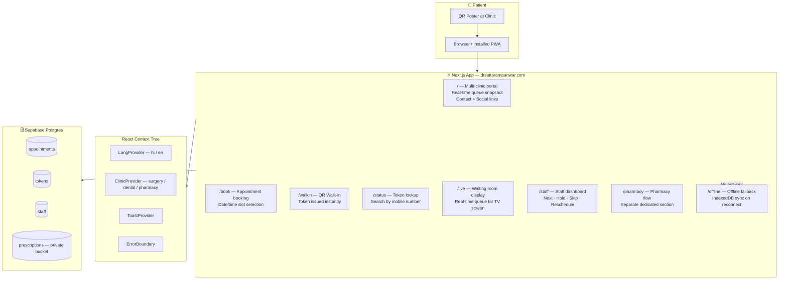

<div align="center">

# 🏥 Panwar Health Care — Smart Queue PWA

### Production healthcare system handling **100+ daily patients**

**Hindi-First · Offline-Safe · Multi-Clinic · Installable PWA**

[](https://nextjs.org/)
[](https://www.typescriptlang.org/)
[](https://supabase.com/)
[](https://tailwindcss.com/)
[](https://web.dev/progressive-web-apps/)
[](https://drsattarampanwar.com)

[**🚀 Live → drsattarampanwar.com**](https://drsattarampanwar.com)

</div>

---

## 🎯 Real-World Impact

This is not a demo. This is a **production system actively used at Panwar Health Care, Jaisalmer, Rajasthan**:

- 👨‍⚕️ **Dr. Satta Ram Panwar** — Advance Laparoscopic, Gastro & Trauma Specialist Surgeon (MBBS MS FMAS ATLS)
- 🏥 **3 clinics on one URL**: Surgical · Dental (Dhandev Dental) · Pharmacy (Dhanwantri Medical)
- 📊 **100+ patients per day** — queue tokens issued, appointments booked, live status viewed
- 📱 **Installable as a mobile app** — patients add it to their phone home screen

---

## ✨ Patient Experience

A patient arriving at Dr. Panwar's clinic:

1. **Sees the QR poster at the entrance** → scans it → opens `drsattarampanwar.com`
2. **Taps "आज का टोकन लें"** (Get Today's Token) → token issued in under 10 seconds
3. **Gets SMS / on-screen token number** → knows exactly when to come in
4. **Checks "मेरा लाइव टोकन"** (Live Queue) → real-time position without asking staff
5. **Zero phone calls to staff. Zero paper tokens. Zero confusion.**

---

## 🏗️ Technical Architecture



---

## 🎨 Design System

The app uses a **custom CSS token system** (not raw Tailwind utilities) for consistent, clinic-appropriate aesthetics:

```css
/* Accent palette — calming healthcare green */
--accent:          #0f6b63;
--accent-strong:   #00514b;
--accent-soft:     rgba(15, 107, 99, 0.08);
--accent-deep:     #0a4e53;

/* Semantic tokens */
--line:            rgba(19, 49, 58, 0.08);   /* borders */
--success:         #49b56d;

/* Surface */
background: rgba(247, 239, 225, 0.88);  /* warm off-white — not clinical white */
```

**Typography stack (3 fonts, all preloaded):**
- `Plus Jakarta Sans` — headings, UI chrome
- `Outfit` — numeric displays (queue numbers, counts)
- `Noto Sans Devanagari` — Hindi text rendering

Why three fonts? Hindi and Latin scripts have different vertical metrics. A single font that handles both well doesn't exist. This stack renders **"आज का टोकन"** and **"Token #S-042"** with equal crispness on every device.

---

## 💰 Paid Freelance Project

This is a **complete end-to-end paid project** — not a tutorial or side project.

| Detail | Info |
|---|---|
| **Client** | Dr. Satta Ram Panwar (MBBS MS FMAS ATLS) |
| **Specialty** | Advance Laparoscopic, Gastro & Trauma Surgeon |
| **Location** | Jaisalmer, Rajasthan |
| **Domain** | [drsattarampanwar.com](https://www.drsattarampanwar.com) |
| **Clinics Served** | Surgical · Dental (Dhandev) · Pharmacy (Dhanwantri) |
| **Type** | Paid Freelance — Full delivery (Design → Dev → Deploy) |
| **Status** | 🟢 Live & actively used in production |

**What was delivered:**
- ✅ Complete PWA — installable, offline-capable
- ✅ Real-time queue system with Supabase Realtime
- ✅ Multi-clinic architecture (3 clinics, 1 codebase)
- ✅ Hindi-first interface with language toggle
- ✅ Staff dashboard for queue management
- ✅ QR walk-in token flow
- ✅ Appointment booking system
- ✅ Production deployment on Vercel with custom domain

---

## 👨‍💻 Developer

**Kuldeep Panwar** — Full-Stack Developer & Designer

[](https://github.com/kuldeepxpanwar)
[](https://www.instagram.com/kuldeepxpanwar)
[](mailto:panwarkuldeep256@gmail.com)

📞 **+91 93587 52147** (Call / WhatsApp)

> Specializing in **healthcare PWAs**, clinic management systems, Hindi-first digital products, and real-time web applications for Indian markets.

---

<p align="center">
  Built for real patients. Solving real problems. Running in production. 🏥
</p>

